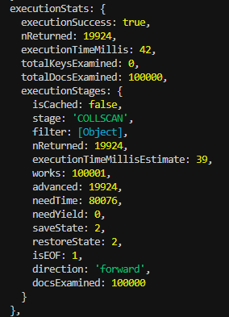
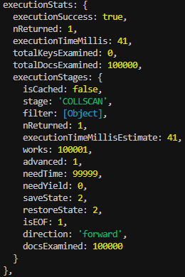
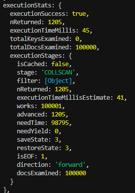
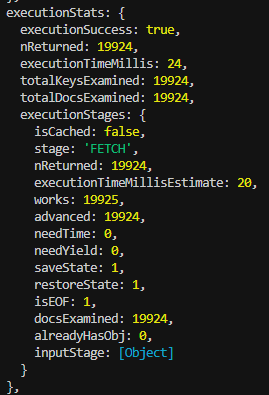
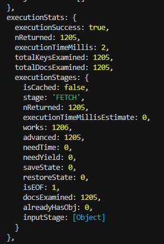

# Optimizacion de consultas en MongoDB

Esta es una actividad para reforzar los conocimiento obtenidos durante las clases de Base de datos II, en las cuales debemos hacer uso de idices para optimizar consultas en una base de datos no relacional (MongoDB). El hacer uso de los indices, nos ayuda a hacer que nuestras consultas puedan ser mas eficientes la momento de solicitar alguna informacion de nuestr base de datos

## **Tecnologías utilizadas**

*   Node.js
*   Express
*   MongoDB
*   Mongoose
*   dotenv
*   cors

## Instalación

1.  Clona este repositorio:

    git clone https://github.com/SooyAldahir/Optimization_of_Consultations_in_MongoDB.git


2.  Instala las dependencias:

    npm install    


3.  Crea un archivo .env en la raíz del proyecto y añade la URI de conexión a tu base de datos MongoDB:

    MONGO_URI = mongodb://127.0.0.1:27017/{tuBaseDeDatos}
    
## Uso

1.  Inicia el servidor:
    
bash
    node server.js
    node src/APIserver.js

2.  La API estará disponible en http://localhost:3000 (o el puerto que hayas configurado).

## **Rutas de la API**

1. Obtener productos por categoría
- Método: GET
- Ruta: /api/products/category/:category
- Descripción: Obtiene todos los productos que pertenecen a una categoría específica.
#### Parámetros:
- category (requerido): Nombre de la categoría.
#### Ejemplo de respuesta:
```json
[
  {
    "_id": "603c9e2a1f6b8d1a58d29f0d",
    "name": "Product 1",
    "category": "electronica",
    "price": 299.99,
    "stock": 25,
    "date": "2025-03-01T00:00:00Z"
  }
]

```

2. Buscar productos por nombre
- Método: GET
- Ruta: /api/products/name/:name
- Descripción: Busca productos que coincidan con el nombre proporcionado.
#### Parámetros:
- name (requerido): Nombre del producto.
#### Ejemplo de respuesta:
```json
[
  {
    "_id": "603c9e2a1f6b8d1a58d29f0d",
    "name": "Product 1",
    "category": "electronica",
    "price": 299.99,
    "stock": 25,
    "date": "2025-03-01T00:00:00Z"
  }
]
```

3. Obtener productos por rango de fechas
- Método: GET
- Ruta: /api/products/date-range?startDate=yyyy-mm-dd&endDate=yyyy-mm-dd
- Descripción: Obtiene productos cuya fecha esté dentro de un rango específico.
#### Parámetros (query):
- startDate (requerido): Fecha de inicio (formato YYYY-MM-DD).
- endDate (requerido): Fecha de fin (formato YYYY-MM-DD).
#### Ejemplo de respuesta:
```json
[
  {
    "_id": "603c9e2a1f6b8d1a58d29f0d",
    "name": "Product 1",
    "category": "electronica",
    "price": 299.99,
    "stock": 25,
    "date": "2025-03-01T00:00:00Z"
  }
]

```
## **CRUD de la API**
1. Crear un nuevo producto
- Método: POST
- Ruta: /api/products
- Descripción: Crea un nuevo producto en la base de datos.
#### Body (JSON):
```json
{
  "name": "",
  "category": "",
  "price": 0.0,
  "stock": 0,
  "date": "yyyy-mm-dd"
}
```

2. Obtener todos los productos
- Método: GET
- Ruta: /api/products
- Descripción: Obtiene todos los productos de la base de datos.
#### Ejemplo de respuesta:
```json
[
  {
    "_id": "603c9e2a1f6b8d1a58d29f0d",
    "name": "Product 1",
    "category": "electronica",
    "price": 299.99,
    "stock": 25,
    "date": "2025-03-01T00:00:00Z"
  }
]

```

3. Obtener un producto por ID
- Método: GET
- Ruta: /api/products/:id
- Descripción: Obtiene un producto específico por su ID.
#### Parámetros:
- id (requerido): ID del producto en la base de datos.
#### Ejemplo de respuesta:
```json
{
  "_id": "603c9e2a1f6b8d1a58d29f0d",
  "name": "Product 1",
  "category": "electronica",
  "price": 299.99,
  "stock": 25,
  "date": "2025-03-01T00:00:00Z"
}
```

4. Actualizar un producto por ID
- Método: PUT
- Ruta: /api/products/:id
- Descripción: Actualiza los detalles de un producto específico.
#### Parámetros:
#### id (requerido): ID del producto.
#### Body (JSON):
```json
{
  "name": "Updated Product",
  "category": "electronica",
  "price": 350.00,
  "stock": 30,
  "date": "2025-03-05"
}
```

5. Eliminar un producto por ID
- Método: DELETE
- Ruta: /api/products/:id
- Descripción: Elimina un producto de la base de datos.
#### Parámetros:
- id (requerido): ID del producto.
#### Ejemplo de respuesta:
```json
{
  "message": "Producto eliminado exitosamente"
}
```

### El modelo de datos utilizado es una coleccion de productos con los siguientes campos:
- `name`: Nombre del producto.
- `category`: Categoría del producto (por ejemplo, "electronica", "ropa").
- `price`: Precio del producto.
- `stock`: Cantidad disponible en inventario.
- `date`: Fecha de creación o actualización del producto.

### Comparacion de tiempos de ejecucion:
#### Sin indices:
- Consulta por categoría: **Tiempo sin índices: 42 ms**
- Consulta por nombre: **Tiempo sin índices: 41 ms**
- Consulta por fecha: **Tiempo sin índices: 45 ms**

#### Con indices:
- Consulta por categoría: **Tiempo con índices: 24 ms**
- Consulta por nombre: **Tiempo con índices: 0 ms**
- Consulta por fecha: **Tiempo con índices: 2 ms**

### Análisis del Impacto de los Índices:
Al ejecutar los scripts sin haber creado los índices previamente, se observa que el tiempo de ejecución se mantiene entre 40 y 46 ms, sin importar el tipo de consulta que se realice. Esto indica que, en ausencia de índices, MongoDB tiene que realizar un escaneo completo de la colección, lo que ralentiza las consultas. Sin embargo, al analizar los tiempos de ejecución de los mismos scripts después de haber creado los índices, se nota una diferencia sumamente significativa. En al menos dos de los scripts, el tiempo de ejecución se redujo en aproximadamente un 95%, mientras que en el tercero la reducción fue de aproximadamente un 50%. Esto demuestra que la implementación de índices tiene un impacto considerable en el rendimiento de las consultas, ya que permite a MongoDB acceder a los datos de manera mucho más eficiente. Los índices son esenciales cuando se manejan grandes volúmenes de datos, ya que optimizan la búsqueda y mejoran significativamente la velocidad de las consultas, disminuyendo la carga en el sistema y evitando escaneos innecesarios de la colección. Esto resalta la importancia de utilizar índices en bases de datos MongoDB, especialmente cuando se trata de colecciones grandes y consultas frecuentes. 

## Conclusion
El uso de índices en MongoDB tiene un impacto muy positivo en el rendimiento de las consultas. Sin índices, el motor de base de datos realiza un escaneo completo de la colección para encontrar los datos, lo que puede ser muy ineficiente y generar tiempos de respuesta más altos, especialmente cuando se trabaja con grandes volúmenes de datos.

Tras implementar los índices en las rutas de consulta por categoría, nombre y fecha, se observó una reducción significativa en los tiempos de ejecución de las consultas, lo que demuestra que los índices permiten a MongoDB acceder a los datos de manera más rápida y eficiente, sin necesidad de realizar búsquedas exhaustivas en toda la base de datos.

## Logs de ejecucion utilizando  .explain("executionStats") en las consultas.

Scripts antes de crear los indices

- Script para consultar una categoria
<p align="center">
  
</p>

- Script para buscar por nombre
<p align="center">
  
</p>

- Script para consultar por fecha
<p align="center">
  
</p>


Scripts despues de crear los indices

- Script para consultar una categoria
<p align="center">
  
</p>

- Script para buscar por nombre
<p align="center">
  
</p>

- Script para consultar por fecha
<p align="center">
  
</p>

